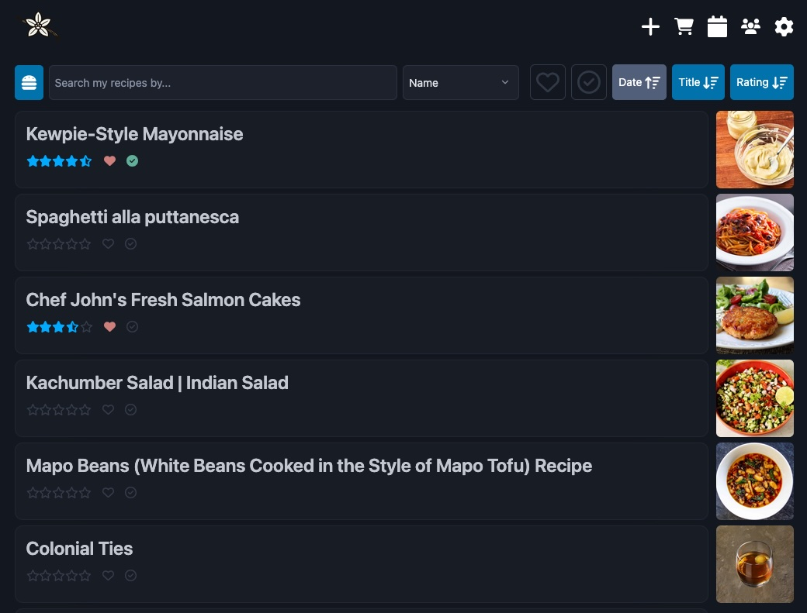
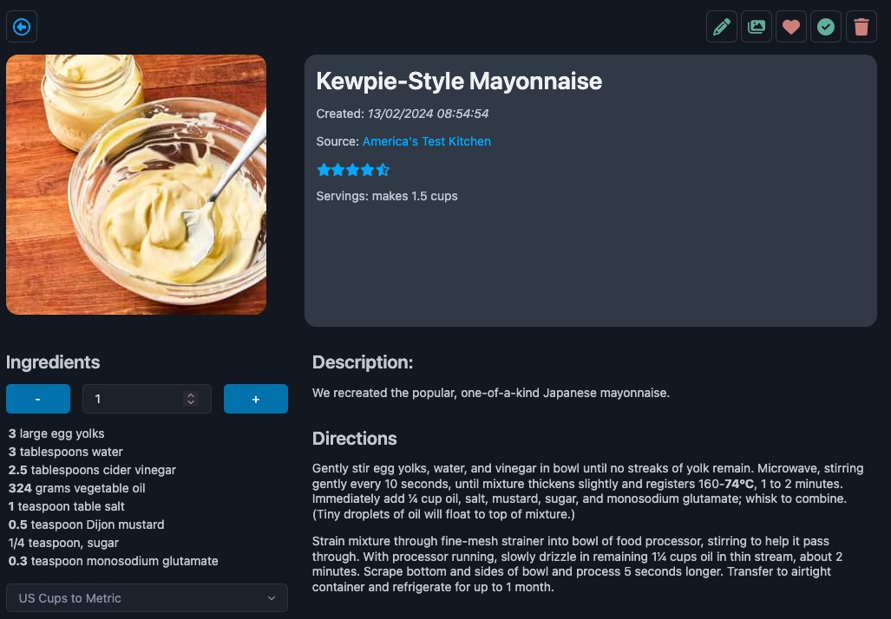

For a full getting started guide, [read the docs](https://vanilla-cookbook.readthedocs.io/en/latest/).




# Getting Started for Local Dev

1. Clone the repo and the recipe-ingredient-parser submodule: `git clone --recursive https://github.com/jt196/vanilla-cookbook.git`
2. At the root of the project, create the .env file: `cp .env.template .env`
3. In the _.env_ file
   1. Add your admin user details
   2. Set `ORIGIN` to `http://localhost:5173` (dev).
4. Install the node packages: `pnpm i`
5. Run it
   - `pnpm dev:setup` (this should only need to be run the first time to generate the )
   - `pnpm dev`

# Getting Started with Docker

1. In your project directory, create the _.env_ and _docker-compose.yml_ files using the respective _.template_ files in the repo root
2. In the _.env_ file
   1. Add the admin user details.
   2. Change the _ORIGIN_ to the URL it's going to be hosted on. If you get any login CORS messages, this not being set correctly will be the reason. The default `ORIGIN=http://localhost:3000` should work with the default _docker-compose.yml_ file unless you have anything else on that port.
3. Create _db_ and _uploads_ folders for persistence in your docker folder, make sure the share paths are correct in the docker-compose file.
4. Run `docker-compose up -d`

# .env Files

## .env

- The main .env file allows you to specify the main admin user details.
- When the database is seeded, it'll either use the details there, or if not specified, it'll use the alternatives in the _seed.js_ file in the prisma folder.
- You'll need to specify the **ORIGIN** variable, e.g. the URL of your installation. You will not be able to log in if this is not correctly input.
- The **BODY_SIZE_LIMIT** variable determines the limit of file uploads. If you want to upload large Paprika files, this will need changing.
- The Paprika import directory in the _paprikaAPIUtils.js_ file is a little complex. Currently the code looks like this:

```JS
export const appRootPath =
	import.meta.env.VITE_APP_ROOT_PATH ||
	process.env.APP_ROOT_PATH ||
	path.join(__dirname, '../../../../..')
```

- Where the **VITE_APP_ROOT_PATH** is the full path to the project folder - residing in _.env.localproduction_.

  - This is for local production builds, and is run with `pnpm build:localprod` - the
  - The **APP_ROOT_PATH** variable is for the docker deployment
  - And the `path.join(__dirname, '../../../../..')` part is for `pnpm dev` when docker or localproduction .env variables haven't been specified.

- I'm going to work to make this simpler, but you shouldn't need to do anything unless you're running a localproduction server, in which case you'll need a _.env.localproduction_ file, and to run the build process with the `:localprod` tag as specified above.

# Paprika Importing

If you have recipes inside Paprika, the best workflow is the following:

## 1. Import Categories via API

The API category file contains hierarchical information that the recipe file doesn't export. I've designed the app to take the hierarchy into account.

1. Go to Settings > Import
2. Enter your Paprika user/pass
3. Click on Download Paprika Categories
4. If successful, you should see some feedback.
5. If you refresh the page, you should see some information about your download. (I need to make this happen after import)
6. Press the import categories button.
7. You should see a success message, and the number of categories in DB should match up with the file categories.
8. You can delete the file now, or leave it as a backup.

## 2. Import Recipes via File

1. Go to Settings > Upload
2. Browse a file to upload (if it's more than 5MB, you'll need to change the BODY_SIZE_LIMIT env variable in the main .env file)
3. If you have access to the _Uploads/Imports_ folder, you can also copy the file in there. You'll need to rename it <user*id>*<myfile>.paprikarecipes, e.g. _aXronQVri1BCbeK_recipes.paprikarecipes_. If you go to the main recipes page, your user id should be there in the url, e.g. _user/aXronQVri1BCbeK/recipes_.
4. Once the upload has complete, or the file has been copied and correctly named, you should see it under the **Import an uploaded Paprika file** section.
5. Click import. Check **Recipes Public** if you want your recipes to be public.
6. Delete the file if no longer needed.

## Importing Paprika Recipes via API

_(Not recommended)_

Note this should kind of work, but it's super slow and may cause polling issues. You're downloading a small file which is a list of recipes containing only the _id_ and a few other bits, then polling the API for the full recipe, one by one. It's slow and arduous and will take several minutes. If you have a local file, it'll be much quicker and easier.
