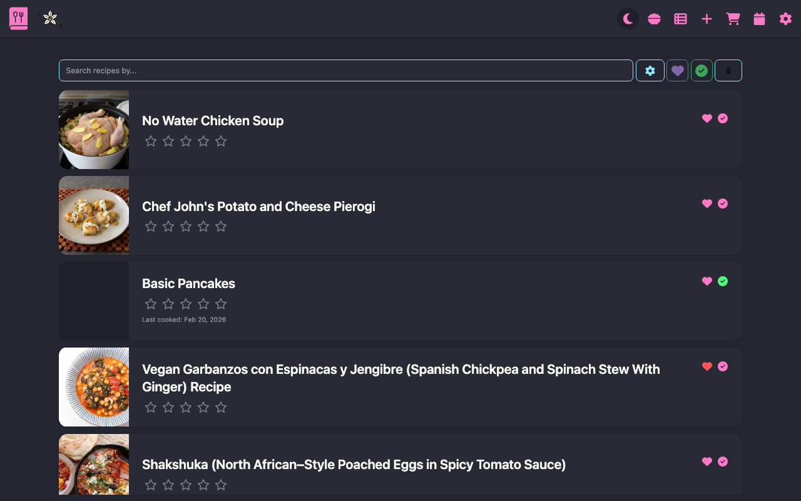
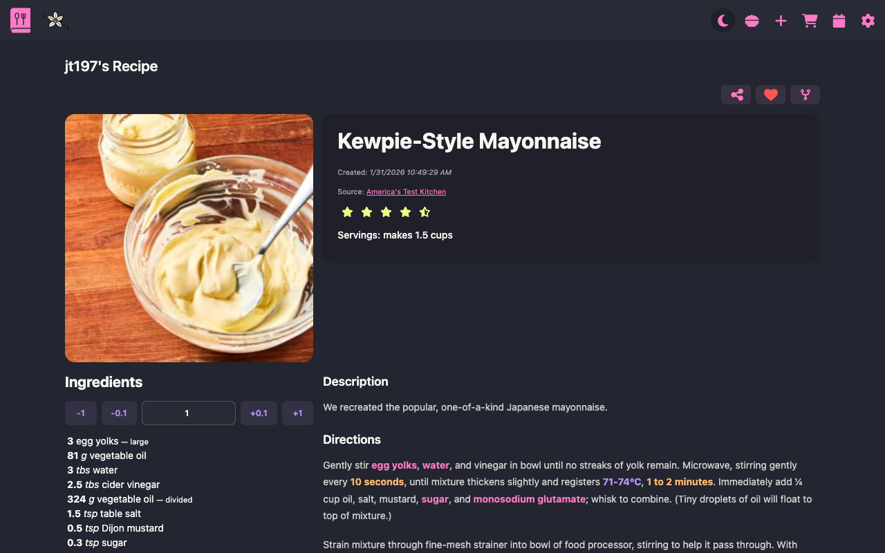
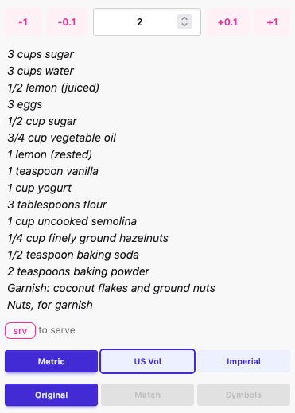
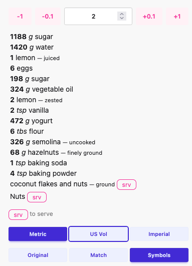
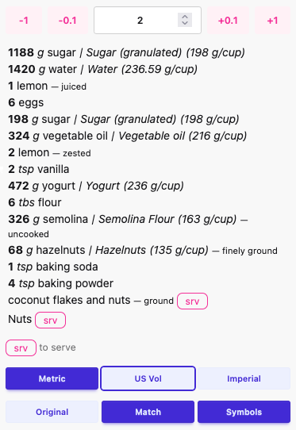

# Vanilla Cookbook

For a full getting started guide, [read the docs](https://vanilla-cookbook.readthedocs.io/en/latest/).

Contributing: [Technical Contributing Guide](docs/technical/contributing.md)

Roadmap: See our [Project Kanban](https://github.com/users/jt196/projects/2/views/1) for what's being worked on, and what's coming up.




## Overview

Vanilla Cookbook is a self hosted recipe manager. It is designed with complexity under the hood, keeping the user experience as uncluttered, simply vanilla as possible.

Most of the web's recipes are written without much thought to a consistent language or structure. Many self-hosted apps go down the structuring route, automating, or asking the user to organise their data. This can lead to cluttered and complex interfaces, meaning you have to work more, just to get cooking. The philosophy behind Vanilla is to do most of that work for the user. You should be able to get cooking with a few clicks.

### Smart Ingredient Display

All based on text string parsing, little or no work to do for the user.

#### Original Ingredient Strings

The following ingredients are based on [this Spruce Eats recipe](https://www.thespruceeats.com/revani-turkish-semolina-cake-3274191). No steps other than importing the recipe were taken.

These are the original ingredients (click on **Original**):



#### Parsed Ingredient Strings

Default display (user units set to metric, display symbols):

Note:

- Scaling of ingredients
- Separation out of instructions
- Quantity/Unit/Ingredient structure
- Badges (To Serve, also Approx/To Taste/Optional)
- Cups have been translated to grams



#### Ingredient Matches Displayed

Volumetric ingredient matches displayed (click on **Match**):



## Features

### Unit Conversion

Smart conversion from US Volumetric to imperial and metric weight. Thousands of ingredients supported in this conversion. Inline temperature conversion, fractions and ranges are also supported. [Docs](https://vanilla-cookbook.readthedocs.io/en/latest/manual/ingredients/#conversion)

### Recipe Scaling

Scale your recipe ingredients. No complicated data entry, it's all done for you, and stored in the original text format.

### Nutrition Parsing

Nutrition text is parsed and displayed in a structured table, with per-serving detection and scale-aware values when applicable. [Docs](https://vanilla-cookbook.readthedocs.io/en/latest/manual/usage/#nutrition)

### Control Your Data

Multiple import formats supported, exports supported. [Docs](https://vanilla-cookbook.readthedocs.io/en/latest/manual/import/)

### Scraping Recipes

Scrape recipes using a browser bookmarklet or simply paste a URL in. Hundreds of sites supported. [Docs](https://vanilla-cookbook.readthedocs.io/en/latest/manual/usage/#recipe-add)

### LLM Assist

Add an LLM API key to activate these features. Google, OpenAI, Anthropic and Ollama currently supported.

[Docs](https://vanilla-cookbook.readthedocs.io/en/latest/manual/usage/#ai-assist)

- Scrape Assist
  - LLM parses the HTML of a page when Schema.org data absent or malformed
  - text analysis - paste in text for saving
- Recipe tweak
  - Messy ingredient tidy up - trimming the fat of those lengthy ingredient strings
  - Directions summarise. Look dude, I know how to boil an egg
- Translate Recipe
  - Detects recipe language
  - Offers translation if recipe language is different.
- Recipe generate from prompt
  - Build a new recipe from a prompt, e.g. "Original pesto genovese"
- Image Analysis
  - Drop up to three photos of your next recipe and it'll parse it into the correct form
- Semantic Search
  - Not just fuzzy search but associative meaning. "Japanese" will throw up noodles, miso etc.
  - [Docs](https://vanilla-cookbook.readthedocs.io/en/latest/manual/usage/#semantic-search)

### Progressive Web App

Install on your mobile from a browser. [Docs](https://vanilla-cookbook.readthedocs.io/en/latest/manual/installation/#mobile)

Share URL via browser to scrape a recipe, or select text and share to parse text.

### Shopping List

- Simple but useable shopping list. Add from your recipes, list history, stats. [Docs](https://vanilla-cookbook.readthedocs.io/en/latest/manual/apps/#shopping)

### Cooking Logs

Log when you've cooked a recipe.

- Calendar view
- Recipe view
- Saves log notes and scaling
- Recook a recipe with previous scaling

[Docs](https://vanilla-cookbook.readthedocs.io/en/latest/manual/apps/#calendar)

### User Management

User authentication is supported. You can manage users, turn on/off registration & site-wide privacy, specify password strength. Optional OAuth login with GitHub, Google, or any OpenID Connect provider (Authentik, Keycloak, etc.). [Docs](https://vanilla-cookbook.readthedocs.io/en/latest/manual/usage/#oauth-sso)

### Automated Database Backups

Docker installations include automatic backups to protect your recipe data:

- **Scheduled backups**: Weekly backups run every Sunday at 3am by default, keeping the 6 most recent backups (6 weeks of history). Configurable via `BACKUP_CRON_SCHEDULE` in `.env` (supports standard cron syntax for daily, monthly, or custom schedules).
- **Pre-migration backups**: Automatic backup created before any database schema migrations to ensure safe upgrades.
- **Retention management**: Configure how many scheduled backups to keep with `BACKUP_RETENTION_COUNT` in `.env` (default: 6).
- **Accessible backups**: All backups are stored in your mounted `./db` folder alongside your active database:
  - `scheduled-backup-YYYYMMDD-HHMMSS.sqlite` - Regular scheduled backups (auto-cleaned)
  - `auto-backup-YYYYMMDD-HHMMSS.sqlite` - Pre-migration backups (preserved)

After changing backup settings, restart the container: `docker-compose restart`

### Public Recipes

Recipes and your personal cookbook can be made public, so you can share them with friends and family. Fork (duplicate - geddit) another member's recipe, or just favourite it to see it in your own feed.

### Easy Installation

Designed to be as easy and stress free to set up as possible. Docker or local node instance.

### Multiple Language Ingredient Parsing

Multiple languages supported for ingredient parsing. [Docs](https://vanilla-cookbook.readthedocs.io/en/latest/manual/ingredients/#languages)

## Installation

Docker set up is dead simple. Single container, portable SQLite database.

### Docker

1. In your project directory, create the _.env_ and _docker-compose.yml_ files using the respective _.template_ files in the repo root:

   ```bash
   curl -o .env https://raw.githubusercontent.com/jt196/vanilla-cookbook/main/.env.template
   curl -o docker-compose.yml https://raw.githubusercontent.com/jt196/vanilla-cookbook/main/docker-compose.yml.template
   ```

2. In the _.env_ file
   - Change the _ORIGIN_ to the URL it's going to be hosted on. If you get any login CORS messages, this not being set correctly will be the reason. The default `ORIGIN=http://localhost:3000` should work with the default _docker-compose.yml_ file unless you have anything else on that port.
3. Create _db_ and _uploads_ folders for persistence in your docker folder, make sure the share paths are correct in the docker-compose file: `mkdir -p ./db ./uploads`
4. Use `:latest` tags for bleedin' edge, `:stable` for stable release.
5. Run `docker-compose up -d`
6. On first run, you'll be prompted to enter Admin user details.

#### Upgrade

1. Grab the latest image: `docker pull jt196/vanilla-cookbook`
2. Check the _.env.template_ and _docker-compose.yml.template_ files haven't been modified. Add any additional fields. The _.env_ is the most likely to change.
3. From the project directory, run `docker-compose up -d` or `docker compose up -d` depending on how you have it installed on your system.

### Local Dev

#### Prerequisites: You'll need build tools installed for native module compilation (better-sqlite3)

- **macOS**: Xcode Command Line Tools (`xcode-select --install`)
- **Linux**: `build-essential` package (Ubuntu/Debian: `sudo apt-get install build-essential`)
- **Windows**: Visual Studio Build Tools or windows-build-tools npm package

#### Setup

1. Clone the repo and the recipe-ingredient-parser submodule: `git clone --recursive https://github.com/jt196/vanilla-cookbook.git`
2. At the root of the project, create the .env file: `cp .env.template .env`
3. In the _.env_ file
   1. Set `ORIGIN` to `http://localhost:5173` (dev).
4. Run it
   - `pnpm i` (node packages install)
   - `pnpm dev:setup` (prisma client gen, migration)
   - `pnpm dev`
5. You'll be prompted for admin user details on accessing root
