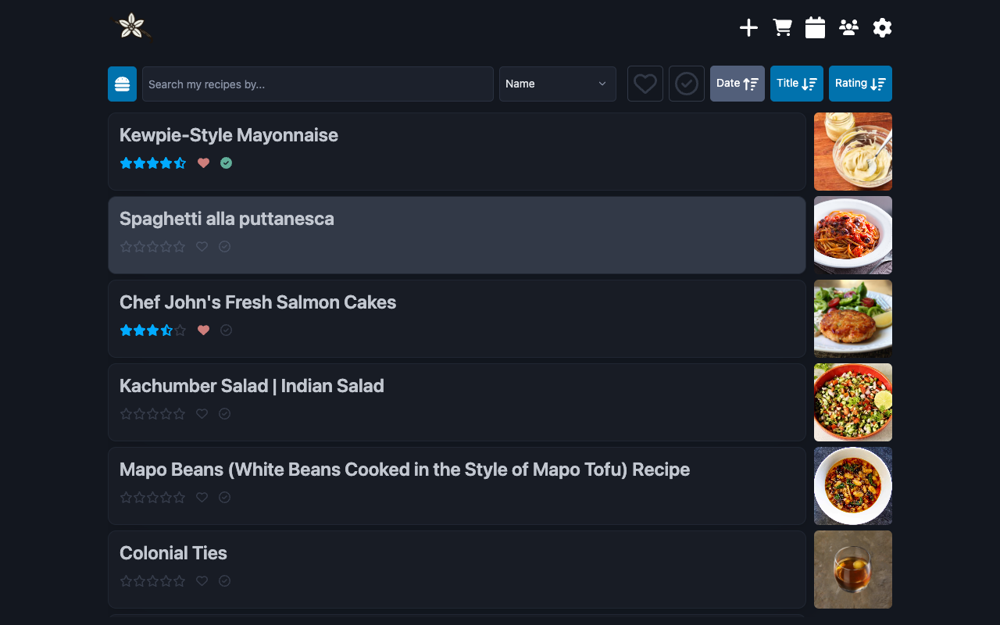
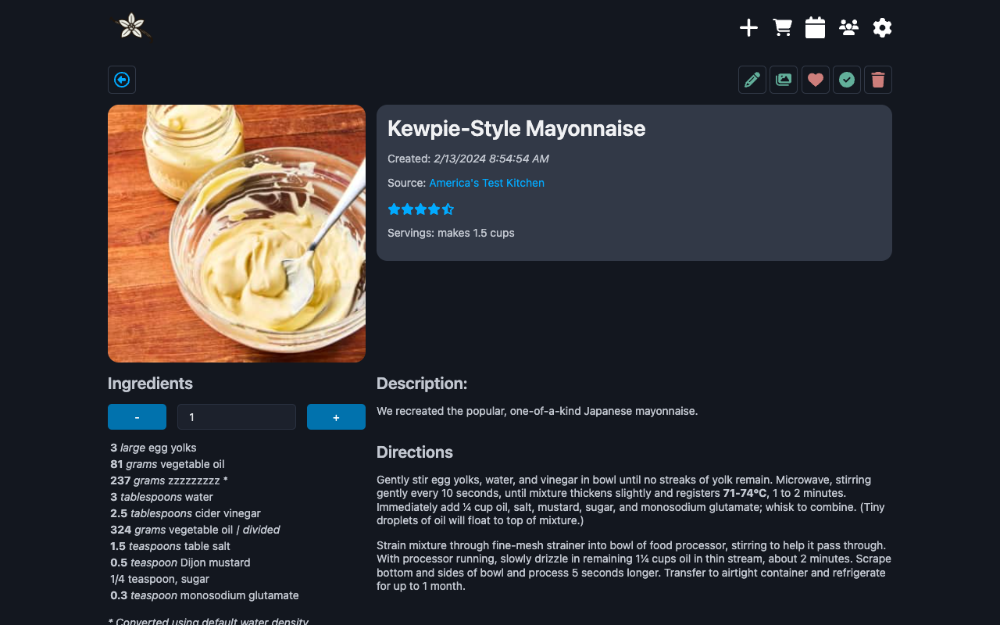

Vanilla Cookbook is a self hosted recipe manager built with Svelte(kit). It is designed with complexity under the hood, keeping the user experience as vanilla as possible.

The philosophy behind building the app was to reduce the complexity for the user to manage their recipes by making everything stored in plain text: all the recipe fields are simple text strings. Scaling and conversion is all done via text parsing. What this means is, if you scrape a recipe, providing the recipe app is doing a good job (caveat emptor!) you can start cooking it straight away. If it doesn't immediately work, a few simple text tweaks should be enough to get you going. Volumetric conversion is done via a dry weight > volume look up from a huge database of 3000 or so ingredients.

# Features


