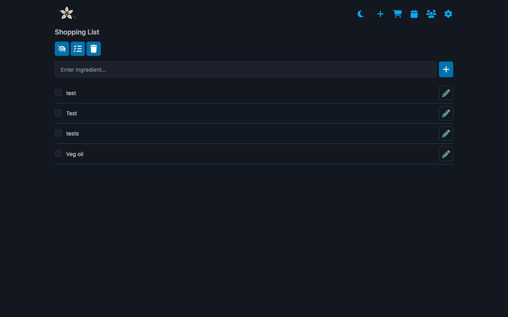

## Shopping

This is a pretty simple checklist.

You can add items via the top, or add them inside a recipe. If the latter, you'll get a link to the recipe.

Checked items are hidden by default, and when they're checked they're not saved. This means you have a list of previously checked items that you can go through for your weekly shop.

Edit or delete individual items using the edit button.

### Buttons

From left to right

- Hide or show checked items
- Mark everything as checked
- Delete ALL checked items

## Calendar

Very simple calendar view of your cooking history.

Month, week or list views.

You'll be able to click on an item to go through to a recipe. Drag and drop to change the cook date/time.
