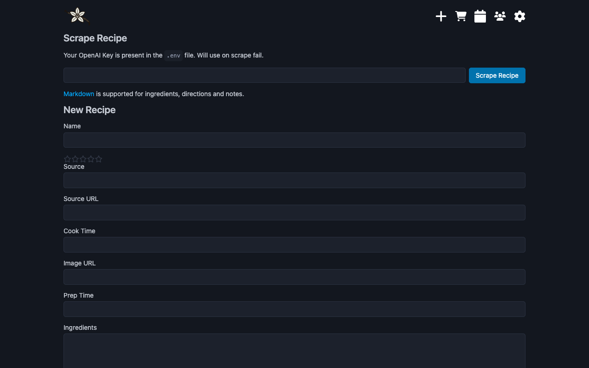
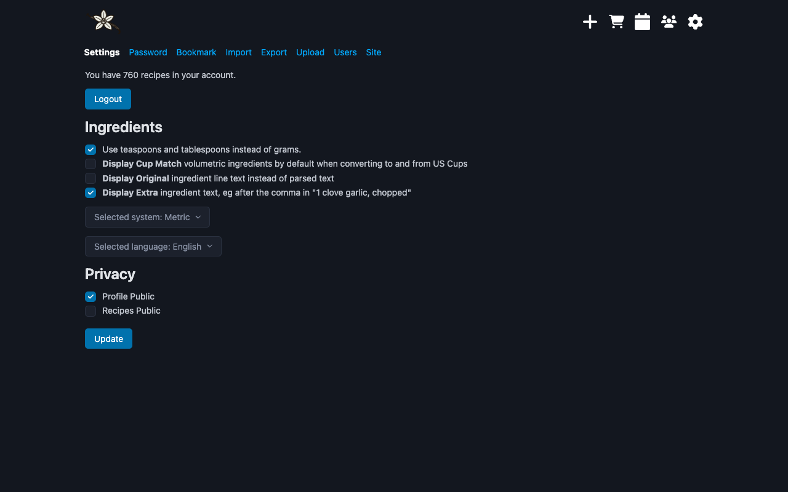
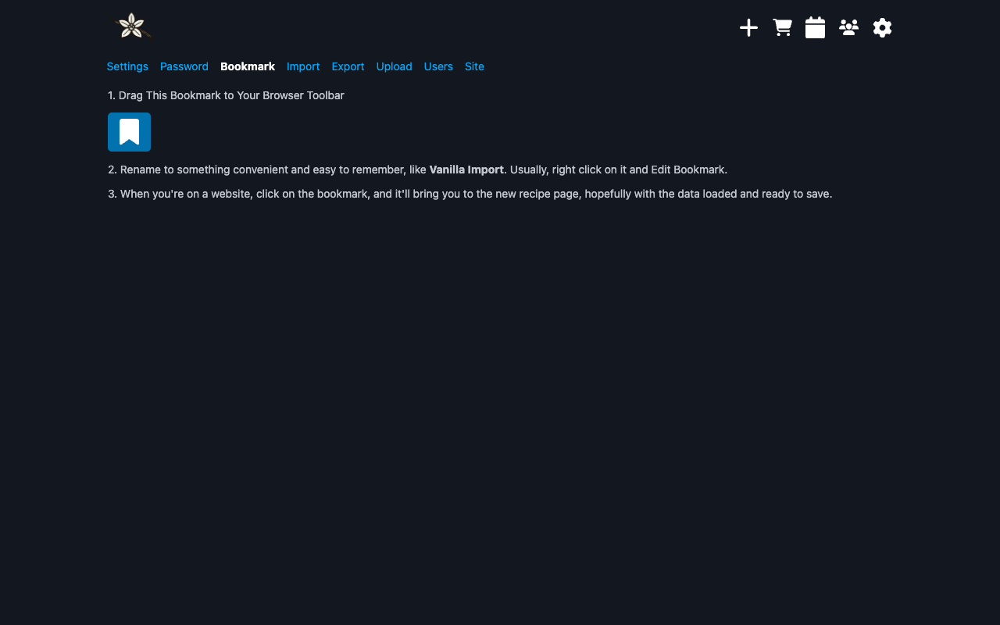
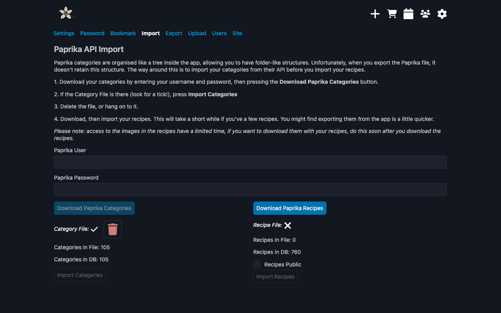
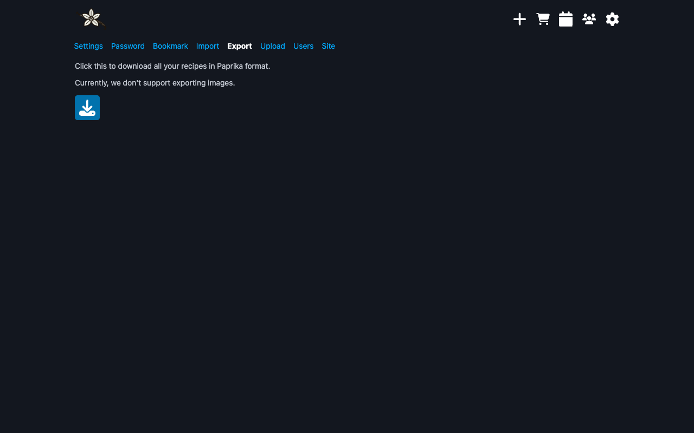
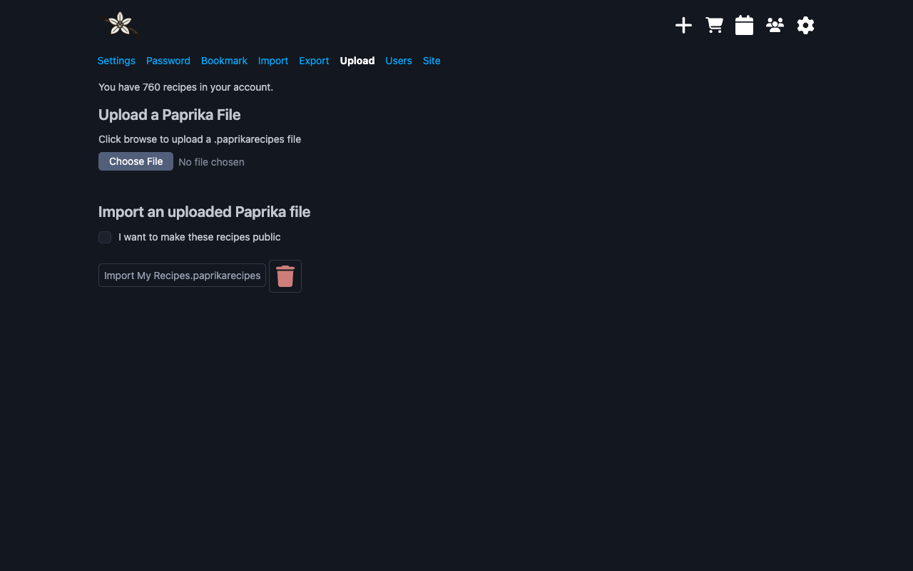
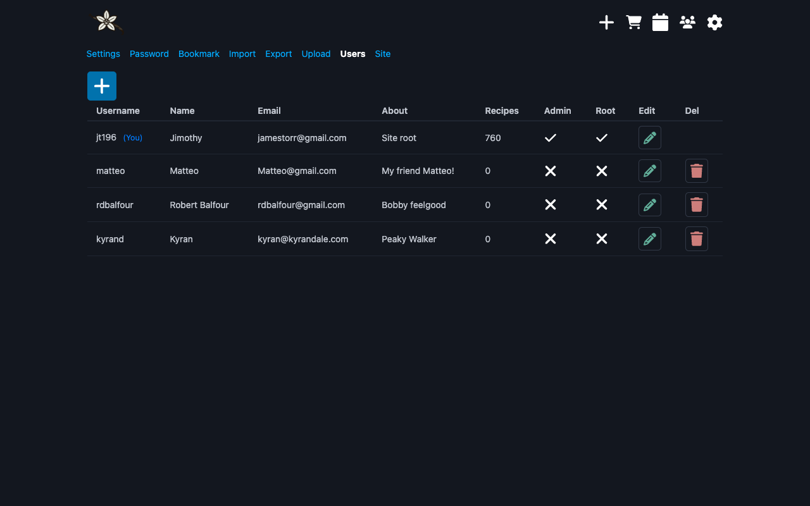
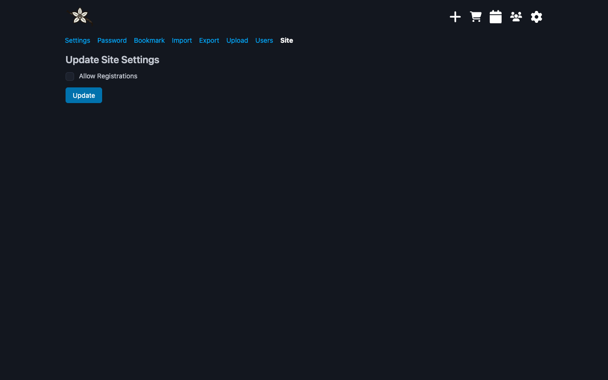

# Recipe List View

## Buttons

From left to right:

- **Add Recipe**: Add new recipes manually or using the scraper
- **[Shopping List](apps.md#shopping)**: A simple list to help you with your weekly shop
- **[Calendar](apps.md#calendar)**: Visual record of your previous cooked recipes
- **Users**: List of the users on your instance
- **Settings**: Configuration section

## Filters

From left to right

- **Display Category Tree** - Imported Paprika categories will be displayed here
- **Filter with text string** - Search by multiple methods
- **Specify filter** - Name, Ingredient, Source, Notes
- **Filter favourites** - List all your favourite recipes
- **Filter cooked** - List all the cooked recipes
- **Sort by Date, Title or Rating** - Sort the recipes by various means

## Recipe Card

Displays info about your recipes.

# Recipe View

## Recipe Buttons

From left to right:

- **Back** to the recipe list
- **Edit Recipe**
- **Manage Images**
- **Favourite Recipe**
- **Mark Recipe as Cooked today**
- **Delete Recipe**

## Recipe About

All your recipe info is here. Ratings, source, creation date, servings.

## Recipe Instructions

Description, Instructions and Notes sections will appear here. Markdown is fully supported.

## Recipe Ingredients

Your list of ingredients and scaling appear here. Markdown is also fully supported. The ingredients are stored as plain text and parsed by the backend. This allows for conversion from US volumetric to weight conversion.

A typical ingredient should appear like this:

- 1 cup of sugar, granulated
- 200g of flour (sifted)

The comma or the brackets are accepted as "extras". If you've got extra extras, this is likely why your ingredient isn't parsing correctly. Open up the editor and adjust the ingredient line to be closer to type.

Click on the ingredient line to mark as "checked" for the duration of the recipe.

Hover over and click to the left of the ingredient to add it to the shopping list.

# Add Recipe

Add your recipe here.

## Scrape It

Either use the old skool bookmarklet (found in /user/options/bookmark), or paste the URL in the first box, then press scrape.

Not all websites are supported, but quite a few, mostly those that have good Schema.org recipe data.

If the standard recipe scrape fails, it'll try with an OpenAI API key.

## AI Assist

Add your OpenAI key to the .env variables. The model will default to 3.5 turbo, but you can change it there.

Set `OPEN_API_ENABLED=true`. The default model should work.

Test the demo on [this URL](https://pastebin.com/raw/zwgsuVKd) to check it works.

It's using the [openai](https://www.npmjs.com/package/openai) npm package, so read the docs there for more info.

Here's a demo of it working:

<video width="640" height="360" controls>
  <source src="../../videos/scrape_manual_ai.mp4" type="video/mp4">
  Your browser does not support the video tag.
</video>

## Add it

Otherwise, add your recipe details and click the **Add Recipe** button at the bottom. The Edit page is basically the same as this. If the images are successfully saved, they'll be in the _uploads/images_ folder.

# Options

I've tried to keep most of the under the hood stuff here.

## Settings

### Ingredients

- **Teaspoons instead of grams** - use these instead of weight for smaller measures
- **Display Cup Match** volumetric ingredients by default when converting to and from US Cups. This is a bit "fuzzy" and not always perfect, so sometimes useful to check what ingredient the system. If no ingredient has been found, you'll see a '\*' and a note that it has been matched to water.
- **Display Original** ingredient line text instead of parsed text. The parser will go through an ingredient line and attempt to separate quantity, unit, ingredient and any extra information. If this fails, you can simply use a fallback, but the scaling won't work.
- **Display Extra** ingredient text, eg after the comma in "1 clove garlic, chopped"
- **Selected System** - Choose your preferred measurement system
- **Selected Language** - Choose your language, currently limited to English, Italian, German.

Here's a demo of the language and **Display Original** setting working.

<video width="640" height="360" controls>
  <source src="../../videos/lang_settings.mp4" type="video/mp4">
  Your browser does not support the video tag.
</video>

### Privacy

- **Profile public** - show/hide your profile in the _/users_ view
- **Recipes public** - make your recipe public by default

**Bookmark** - grab your bookmarklet for saving recipes to the site.

**Import**, **Export**, **Upload** see the [Import Docs](import.md).

**Users** - admin only. User management. Change passwords, add and remove users etc.

**Site** - admin only. Turn on/off registrations.
