# Usage

## Recipe List View

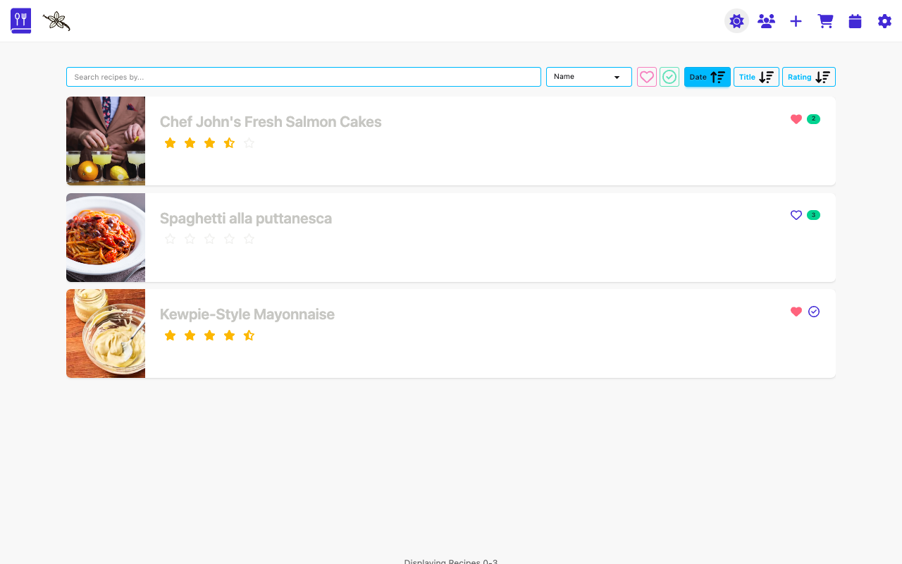

### Buttons

From left to right:

- **Dark/Light Theme Mode**
- **All Recipes**: List of all the public recipes on your Vanilla Instance
- **Add Recipe**: Add a new recipe
- **[Shopping List](apps.md#shopping)**: A simple list to help you with your weekly shop
- **[Calendar](apps.md#calendar)**: Visual record of your previous cooked recipes
- **Settings**: Configuration section

### Filters

From left to right

- **Display Category Tree** - Imported Paprika categories will be displayed here (hidden by default)
- **Filter with text string** - Search by multiple methods
- **Search Fields (cog dropdown)** - Select Name/Ingredients/Source/Notes cumulatively
- **Filter favourites** - List all your favourite recipes
- **Filter cooked** - List all the cooked recipes (sort by x cooked, then alphabetically)
- **Sort (dropdown)** - Date, Title or Rating with 3-state cycle (desc/asc/off)

### Recipe Card

Displays info about your recipes.

## Recipe View

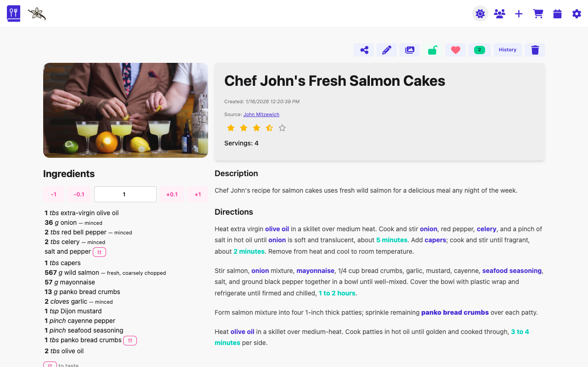

### Recipe Buttons

From left to right:

- **Share** share recipe link
- **Edit Recipe**
- **Manage Images**
- **Make Recipe Public**
- **Favourite Recipe**
- **Mark Recipe as Cooked today**
- **Show Cooked List** (button only visible if cooked.length > 1)
- **Delete Recipe**

### Recipe About

All your recipe info is here. Ratings, source, creation date, servings.

### Recipe Instructions

Description, Instructions and Notes sections will appear here. Markdown is fully supported.

### Recipe Ingredients

Your list of ingredients and scaling appear here. Markdown is also fully supported. The ingredients are stored as plain text and parsed by the backend. This allows for conversion from US volumetric to weight conversion.

Please see the [ingredients docs](ingredients.md) for more details about how to correctly format your ingredients.

Click on the ingredient line to mark as "checked" for the duration of the recipe.

Hover over and click the shopping basket button to the left of the ingredient to add it to the shopping list.

### Ingredient Buttons

You can set your default options in the settings.

#### First Row - Systems

By default, your chosen system will be selected. The recipe system will have an outline.

US Vol = US volumetric, e.g. cups etc.

#### Second Row - Display

Ingredient display has been optimised for easy skimming. We remove some extra stuff, but sometimes you need to check it.

- **Original** - Display original ingredient string. I have this turned off by default, but sometimes it's useful to switch it when converting between Vol <-> Weight
- **Extra** - displays instructions etc - items that go after a comma or are in brackets, e.g. "1 potato, King Edward". I'm often not interested in these extras, but it's handy to just double check what's there.
- **Match** - display the ingredient match when converting between Vol <-> Weight. We match up with a database of ingredients. Sometimes this fails, it's usually worth checking before you start baking a cake...
- **Symbols** - tsp instead of teaspoon etc.

## Recipe Add

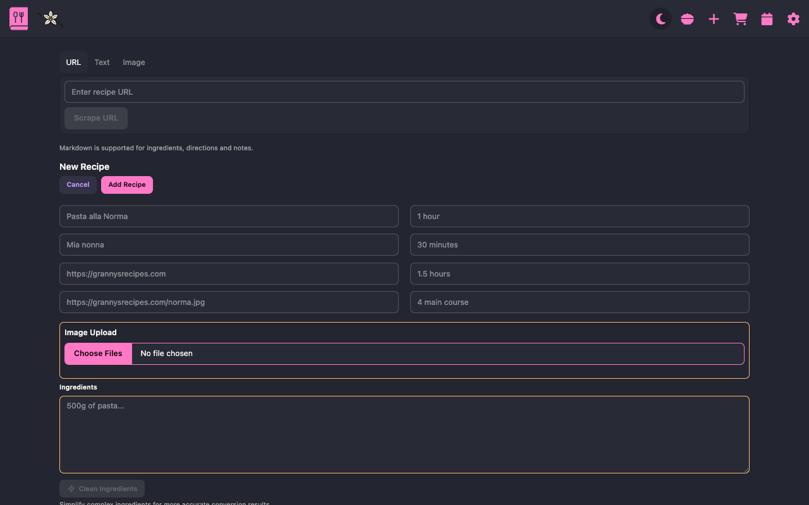

Add your recipe here. Multiple sources accepted:

- Websites with Schema.org recipe schema (most of the web)
- Websites with no schema
- Pasted text
- Prompted text
- Images of recipes

**Android PWA sharing** a URL or text to the new page is supported.

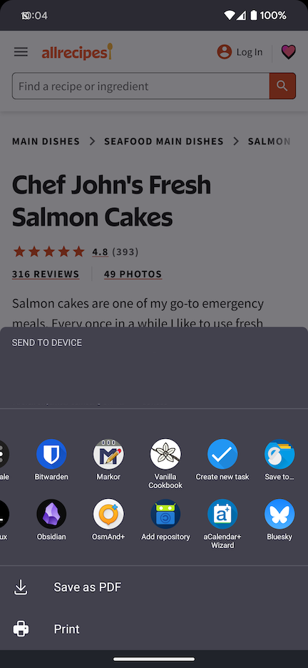

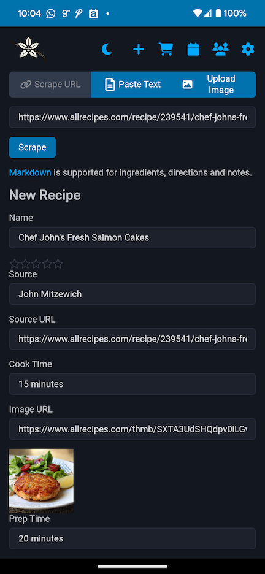

### Websites

Either use the old skool bookmarklet (found in /user/options/bookmark), or paste the URL in the first box, then press scrape.

If the site has a well-formed Schema.org recipe object, you should get a returned, fully formed recipe quite quickly.

If the standard recipe scrape fails (criteria being: no name, no ingredients), it'll try with an OpenAI API key.

### AI Assist

AI-powered features help with recipe scraping, text parsing, image recognition, and ingredient cleanup.

#### Configuration

**Step 1: Add API Keys**

Add one or more API keys to your `.env` file:

```env
# Add keys for the providers you want to use
OPENAI_API_KEY=sk-...
ANTHROPIC_API_KEY=sk-ant-...
GOOGLE_API_KEY=...
# For local models
OLLAMA_BASE_URL=http://localhost:11434
```

**Step 2: Configure in Site Settings**

Go to **Options > Site** (admin only) to configure LLM features:

- **Enable LLM Features** - Turn AI features on/off
- **Provider** - Choose from providers with valid API keys (OpenAI, Anthropic, Google, Ollama)
- **Text Model** - For recipe parsing and text cleanup (recommended: fast/cheap models like GPT-4o Mini, Claude 3.5 Haiku, Gemini Flash)
- **Image Model** - For recipe photo analysis (Ollama doesn't support images)

Each dropdown includes common models with a "Custom..." option if you need a specific model version.

**Supported Providers:**

| Provider  | Text Models                         | Image Models             | Notes                 |
| --------- | ----------------------------------- | ------------------------ | --------------------- |
| OpenAI    | GPT-4o Mini, GPT-3.5 Turbo, GPT-4o  | GPT-4o Mini, GPT-4o      | Full support          |
| Anthropic | Claude 3.5 Haiku, Claude 3.5 Sonnet | Claude 3.5 Sonnet, Haiku | Full support          |
| Google    | Gemini 2.0 Flash, 1.5 Flash/Pro     | Same as text             | Full support          |
| Ollama    | Llama 3.2, Mistral, Phi-3           | Not supported            | Local only, no images |

#### Translate Recipe

Recipe language is detected locally. If the user language is different to the recipe language, the user will have an option to translate the recipe into their own language.

<video width="640" height="360" controls>
  <source src="../../videos/translate-recipe.mp4" type="video/mp4">
  Your browser does not support the video tag.
</video>

#### Scrape Fallback

If the standard recipe scrape fails (no name or ingredients found), it'll automatically submit the HTML to your configured LLM for parsing.

Test the demo on [this URL](https://pastebin.com/raw/zwgsuVKd) to check it works.

Here's a demo of it working:

<video width="640" height="360" controls>
  <source src="../../videos/scrape_and_parse_demo.mp4" type="video/mp4">
  Your browser does not support the video tag.
</video>

#### Text Parsing

Click on the Parse button at the top of the + new page (hidden if AI is not configured) and you'll be presented with a large input box. Paste your recipe in there and see whether an LLM can make something of the data! It works pretty well in the demo above.

#### Image Recognition

Beta-ish, but working on my test computer. Upload up to 3 images; the app will resize and stitch them together for better multi-page parsing, then send to the configured image-capable LLM. It may take a bit longer than text parsing, but not too long. Pukka!

Here's a demo, feel free to fast forward the middle bit where it's waiting for the response... Unless 20 seconds of me wiggling my mouse around sounds attractive.

<video width="640" height="360" controls>
  <source src="../../videos/image_parsing.mp4" type="video/mp4">
  Your browser does not support the video tag.
</video>

#### Clean Ingredients

When adding or editing a recipe, you'll find a "Clean Ingredients" button below the ingredients field (available when AI is enabled). This feature uses AI to tidy up your ingredient list according to these rules:

1. **Remove dual units** - If ingredients have both metric and imperial measurements (e.g., "28g (1oz) flour"), it keeps only your preferred unit system
2. **Standardize alternatives** - Moves alternative ingredients after a comma with "or" (e.g., "1 tomato or 0.5 tin tomatoes" → "1 tomato, or 0.5 tin tomatoes")
3. **Remove brackets** - Removes parentheses while keeping important info after a comma
4. **Move preparation instructions** - Places prep details after a comma (e.g., "1 onion (chopped)" → "1 onion, chopped")
5. **Remove conversational text** - Strips out non-essential text while keeping ingredient data
6. **Use decimal numbers** - Converts fractions to decimals (e.g., "1 1/2 kg" → "1.5 kg")
7. **Remove prepositions** - Eliminates words like "of" (e.g., "1.5 kg of flour" → "1.5 kg flour")

This feature respects your language settings and preferred unit system (metric/US/imperial).

<video width="640" height="360" controls>
  <source src="../../videos/ingredients_tidy_demo.mp4" type="video/mp4">
  Your browser does not support the video tag.
</video>

#### Summarize Directions

Similar to the ingredient cleanup, the "Summarize Directions" button appears below the directions field. This feature condenses verbose recipe instructions to their essential steps, removing:

- Conversational tone and extra explanations
- Unnecessary tips and commentary
- Redundant information

The AI assumes an intermediate level of culinary experience, keeping all necessary steps but making each one more concise. This is particularly useful for recipes scraped from blogs that include lengthy personal anecdotes or overly detailed explanations.

<video width="640" height="360" controls>
  <source src="../../videos/directions_summarize_demo.mp4" type="video/mp4">
  Your browser does not support the video tag.
</video>

### Semantic Search

Semantic search is optional and **admin-controlled**. Users do not need to toggle it.

#### Enablement

1. Add a supported embedding provider in `.env`:
   - `OPENAI_API_KEY` or
   - `GOOGLE_API_KEY` (Gemini embeddings) or
   - `OLLAMA_BASE_URL`
2. In **Options > Site** (admin), enable semantic search.
3. In **Options > Site** (admin), select embedding provider/model.

#### Cost note

- Search-time embedding sends only the query text (for example, `"Japanese"`), not your full recipe database.
- Ballpark with OpenAI `text-embedding-3-small` pricing (~$0.02 per 1M input tokens):
  - **1,000 searches** (short queries): roughly **<$0.001** (typically around $0.0001-$0.0004)
  - **Embedding 1,000 recipes** (one-time index): roughly **$0.01-$0.04** depending on recipe length
- With Ollama, there is no per-request API billing; cost is local CPU/RAM usage.
- Ollama embedding model suggestions:
  - `embeddinggemma` (good default)
  - `qwen3-embedding` (strong quality option)
  - `all-minilm` (lightweight/fast)
- Prices can change over time, so treat these as approximate figures.

#### Build Embedding Index

In **Options > Site** (admin), use the Semantic Embedding Index action to generate embeddings.

- Processing runs in batches.
- You can run repeatedly until remaining reaches zero.
- Progress/status is shown in the admin page and backend logs.

#### When Embeddings Update

- Existing recipes: via admin batch generation.
- New/updated recipes: embedding regeneration is triggered automatically after save/update in the background (non-blocking).

#### Search Behavior

- **No search fields selected (default)**:
  - Search uses semantic + fuzzy/hybrid relevance.
- **Any fields selected** (Name / Ingredients / Source / Notes):
  - Search is scoped to those fields using fuzzy/text matching.
  - Semantic request is skipped in this scoped mode.
- **Sort override**:
  - With no query, default order is most recent first.
  - With a query, default order is relevance.
  - Manual sort selection overrides relevance until cleared.

### Add it

Complete the recipe form, then click the **Add Recipe** button at the bottom. The Edit page is basically the same as this. If the images are successfully saved, they'll be in the _uploads/images_ folder. Image URLs should grab the image and save it there.

## OAuth / SSO

Enable social login with GitHub, Google, or any OpenID Connect provider (Authentik, Keycloak, etc.). You can configure multiple providers - they all appear as options on the login page, and users can link multiple providers to the same account.

### GitHub

Add to your `.env`:

```shell
GITHUB_CLIENT_ID=your_client_id
GITHUB_CLIENT_SECRET=your_client_secret
```

Setup:

- Go to [Developer Settings](https://github.com/settings/developers) > OAuth Apps > New OAuth App
- **Homepage URL**: `https://my-vanilla-site.com`
- **Authorization Callback URL**: `https://my-vanilla-site.com/api/oauth/callback`

### Google

Add to your `.env`:

```shell
GOOGLE_CLIENT_ID=your_client_id
GOOGLE_CLIENT_SECRET=your_client_secret
```

Setup:

- Go to [Cloud Console](https://console.cloud.google.com) > APIs and Services > Credentials
- Create Credentials > OAuth Client ID
- **Authorised JavaScript origins**: `https://my-vanilla-site.com`
- **Authorised redirect URIs**: `https://my-vanilla-site.com/api/oauth/callback`

### Generic OIDC (Authentik, Keycloak, etc.)

For self-hosted identity providers that support OpenID Connect.

Add to your `.env`:

```shell
OIDC_ISSUER_URL=https://auth.example.com/application/o/vanilla/
OIDC_CLIENT_ID=vanilla-cookbook
OIDC_CLIENT_SECRET=your_client_secret
OIDC_NAME=Authentik  # Optional: button label (default: "OIDC")
```

Setup varies by provider, but the key steps are:

1. Create an OAuth2/OpenID application with Authorization Code flow
2. Set redirect URI to `https://my-vanilla-site.com/api/oauth/callback`
3. Use the provider's issuer URL as `OIDC_ISSUER_URL`

See [authentication docs](../technical/authentication.md#generic-oidc-provider) for detailed provider setup examples and claim mapping.

## Public Recipes

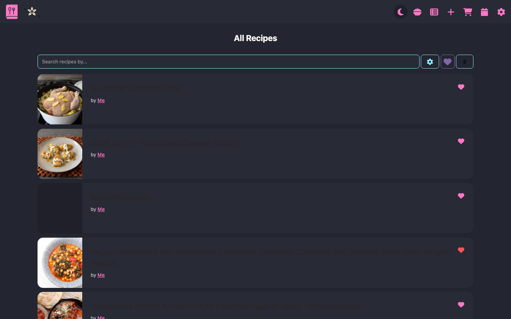

The public recipes page at `/recipes` shows all recipes that have been marked as public by their owners. This allows visitors to browse shared recipes without needing to log in (unless the site has "Require Login" enabled).

## Options

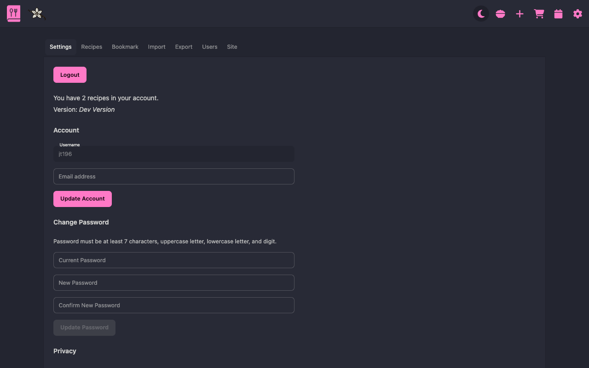

I've tried to keep most of the under the hood stuff here.

### Settings

Account and privacy settings:

- **Username** - View your username (read-only)
- **Email** - Update your email address
- **Change Password** - Update your password
- **Profile public** - show/hide your profile in the _/users_ view
- **Recipes public** - make your recipe public by default

### Recipe Settings

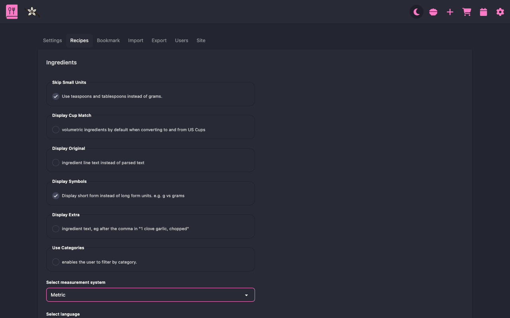

Configure how ingredients are displayed. See also [ingredients docs](./ingredients.md)

- **Teaspoons instead of grams** - use these instead of weight for smaller measures
- **Display Cup Match** - set as default
- **Display Original** - set as default
- **Display Extra** - set as default
- **Selected System** - Choose your preferred measurement system
- **Selected Language** - Choose your language

Here's a demo of the language and **Display Original** setting working.

<video width="640" height="360" controls>
  <source src="../../videos/lang_settings.mp4" type="video/mp4">
  Your browser does not support the video tag.
</video>

### Bookmark

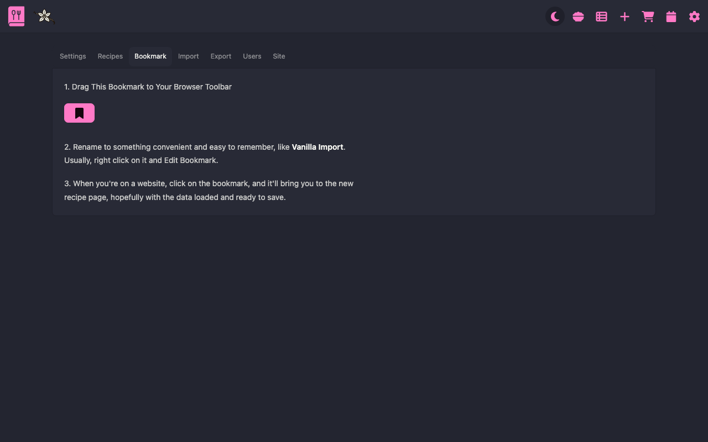

Grab your bookmarklet for saving recipes to the site.

### Import / Export

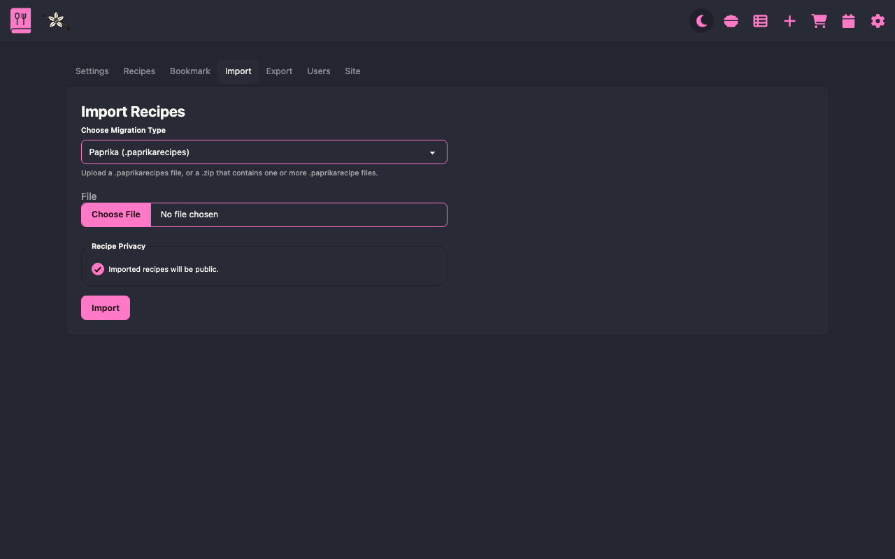
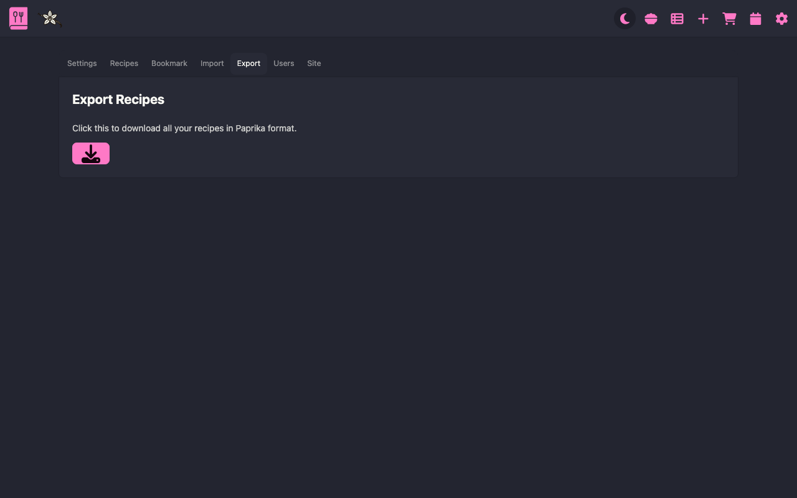

See the [Import Docs](import.md) for details on importing and exporting recipes.

### Users (Admin)

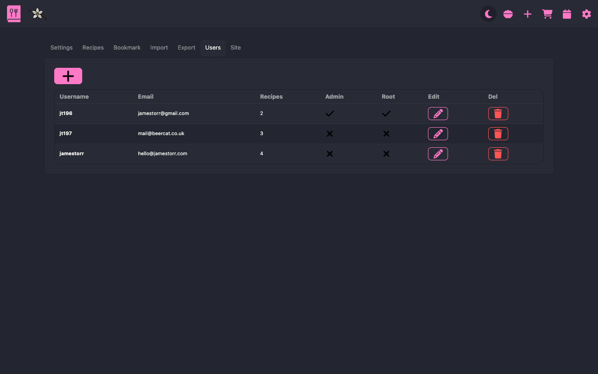

Admin only. User management including:

- Change passwords
- Add and remove users
- Manage admin privileges

### Site (Admin)

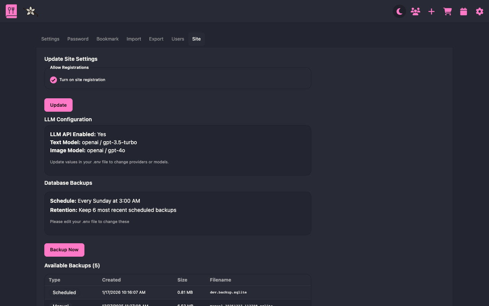

Admin only. Site-wide settings including:

- **Registration** - Turn on/off new user registration
- **Require Login** - Enable private site mode (all visitors must log in to access any page)
- **LLM Configuration** - Enable AI features, choose provider and models
- **Password Requirements** - View current password policy (configured via .env)
- **Database Backups** - View backup schedule and create manual backups
